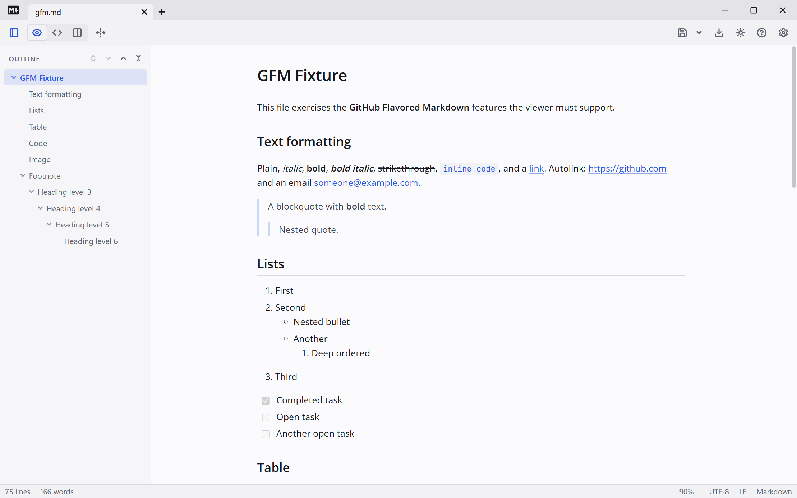
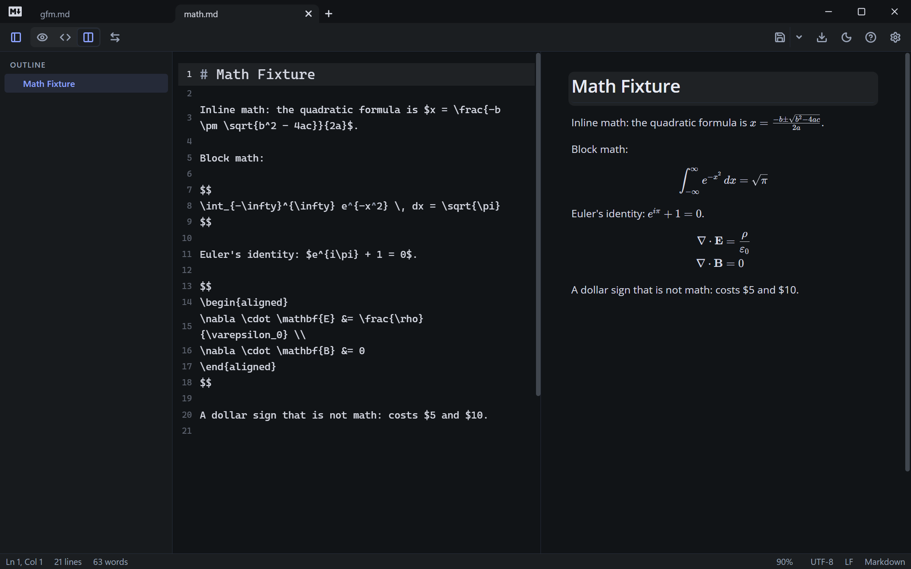

# Markdown

A small, fast Markdown viewer and editor for Windows. Double-click a `.md` file and it opens
rendered, like a document; flip to Source to edit the raw text, or Split to see both at once.
Built with Tauri 2 (Rust + WebView2), React, CodeMirror 6, markdown-it, Shiki, KaTeX and Mermaid.

<p align="center">
  
  
</p>

## Install

Download `Markdown_<version>_x64-setup.exe` from the
[Releases page](https://github.com/Bilalbd/mark-down-app/releases) and run it. It's a per-user
install (no admin rights needed) and registers the app for `.md` and `.markdown` files, so
*Open with* and double-click work. It needs the WebView2 runtime, which is already built into
Windows 11.

The installer isn't code-signed, so Windows SmartScreen may warn when you first run it — choose
**More info → Run anyway** to continue.

## Features

**Reading**

- Formatted, Source and Split views (`Ctrl+E`, `Ctrl+Shift+E`), with the source line kept in
  place when you switch and bidirectional scroll sync in Split. An optional, off-by-default
  highlight (Settings → General → Layout) tints the formatted block that holds the source cursor.
- A full-width toggle in Formatted view fits the document to the window instead of the preset's
  usual content width; it's remembered.
- GFM tables, task lists, footnotes and autolinks; fenced code with Shiki syntax highlighting;
  KaTeX maths (`$…$`, `$$…$$`); Mermaid diagrams; colour swatches next to HEX codes (`#6cb6ff`).
- **Outline** sidebar (`Ctrl+\`) — collapsible, resizable, click a heading to jump to it, follows
  your scroll.
- **Find** (`Ctrl+F`) in either view.
- **Zoom** the rendered document (`Ctrl+=`, `Ctrl+−`, `Ctrl+0`, or `Ctrl` + wheel) — the Source
  editor has its own Font size setting instead.
- **Status bar** (toggleable) shows line and word counts, cursor position in Source, preview
  zoom (click to reset), file encoding and line-ending style.
- Links: `http(s)`/`mailto:` open externally; a relative link to another Markdown file opens it
  in the app; a relative link to anything else reveals it in File Explorer; `#anchor` links scroll
  to the heading.
- **Block remote images** (off by default, in Settings) stops `http(s)` image sources from
  loading in the preview, for documents you don't fully trust.

**Writing**

- A Source editor with Markdown syntax highlighting.
- Right-click in the Source editor for a menu with formatting (Heading, Bold, Italic,
  Strikethrough, Inline code, Link, Code block, Quote, Bulleted/Numbered/Task list, Horizontal
  rule) plus Cut, Copy, Paste and Select all; the **Menu** key or **Shift+F10** opens it at the
  cursor without a mouse. In the formatted view, right-click offers Copy and Select all.
- Formatting shortcuts: `Ctrl+B`, `Ctrl+I`, `Ctrl+K`, and `Ctrl+Shift+1…6` for headings (press a
  heading's own shortcut again to turn it back into a paragraph).
- Spell check with red wavy underlines — see below.
- `Ctrl+S` to save, `Ctrl+Shift+S` to save as, a dirty indicator in the title bar, and a
  Save / Don't save / Cancel guard whenever you'd otherwise lose unsaved changes. Saving a new,
  untitled document for the first time suggests a file name from its first heading (or first
  line, if it has none).
- Reads and preserves UTF-8 (with or without a byte-order mark) and UTF-16 (LE/BE), and
  CRLF/LF line endings, round-tripping each on save; a file with invalid-UTF-8 bytes asks before
  saving over them.

**Tabs and windows**

- Open files as tabs in one window, or each in its own window — set by **Open files in** in
  Settings → General → Window (default: New tab).
- Drag files in from Explorer, use `Ctrl+O` to open several at once, or reopen one from **Recent
  files**.
- Drag a tab to reorder it, or use `Ctrl+Shift+←/→`; right-click a tab for Close, Close others,
  Close to the right, Copy path and Reveal in File Explorer.
- A file already open in a tab is focused instead of opened a second time. Opening a `.md` file
  from Explorer while the app is running adds a tab to the running window (which comes to the
  front), or opens a new window, depending on the same setting.

**Styling**

- Nine built-in presets — Boulayla (the default), GitHub, Obsidian, Claude, Manuscript, Nord,
  Rosé Pine, Catppuccin and Solarized — each with its own light and dark colour set, so it looks
  right in both app themes.
- Every font, size, spacing and colour is editable in Settings → Appearance (`Ctrl+,`); presets can
  be copied, renamed, and exported or imported as JSON, and each has a custom-CSS slot. Settings
  has five pages (General, Editor, Appearance, Shortcuts, About) and sits beside the document, so
  you see changes as you make them.
- A searchable **font picker** for the body, heading and code fonts, each font shown in its own
  typeface. It lists **Built in** fonts (19 of them, bundled so they work offline, including three
  Arabic ones), fonts **On this PC**, and about 2,000 **Google Fonts**, which the app downloads
  once, on request, and then loads from disk. The code font lists monospace fonts only, and a
  filter shows fonts that support Arabic. A custom CSS font list is still available for anything
  else. Bundled fonts include only Latin and Arabic characters; other scripts use a system font.
- A separate **Light / Dark / Follow Windows** theme for the app's own chrome.

**Export and print**

- Export as a standalone HTML file. With **Self-contained HTML export** on (the default), local
  images, the maths font and the built-in and downloaded Google fonts the preset uses are embedded
  as data URLs so the file works offline anywhere; remote images stay linked, and fonts installed
  on your PC (which licences usually don't let anyone embed) fall back to whatever's on the system
  that opens it.
- Print, or save as PDF, through the normal Windows print dialog.

**Files and safety**

- **Live reload** when the file changes on disk, asking first if you have unsaved edits.
- Every action that would discard unsaved work — opening another file, closing a tab, closing the
  window — asks first.
- Saves are atomic (a temp file, then a rename), so a crash or a full disk can't leave the file
  half-written, and they keep the file's original line endings and encoding.

## Spell check

Spell check runs in the Source editor, using the languages installed in Windows, and underlines a
word only if *every* language you've ticked rejects it (so notes that mix languages work
correctly). It's on by default and checks your Windows display language until you choose
otherwise, in **Settings → Editor → Spelling** — the list shows one entry per language, and
right-clicking a misspelled word offers suggestions, **Add to dictionary** and **Ignore**. To add
a language that isn't listed, install it in Windows under **Settings → Time & language → Language
& region → Add a language**; spelling comes with its basic typing feature, no separate download
needed.

## Keyboard shortcuts

**Files**

| Shortcut | Action |
|---|---|
| Ctrl+N | New file |
| Ctrl+O | Open file |
| Ctrl+S | Save |
| Ctrl+Shift+S | Save as |

**Tabs**

| Shortcut | Action |
|---|---|
| Ctrl+T | New tab |
| Ctrl+W | Close tab |
| Ctrl+Tab / Ctrl+Shift+Tab | Next / previous tab |
| Ctrl+PageDown / Ctrl+PageUp | Next / previous tab |
| Ctrl+1 … Ctrl+9 | Go to tab |
| Ctrl+Shift+← / Ctrl+Shift+→ | Move tab left / right |

**Views**

| Shortcut | Action |
|---|---|
| Ctrl+E | Toggle formatted / source |
| Ctrl+Shift+E | Toggle split view |
| Ctrl+\ | Toggle outline |
| Ctrl+F | Find |
| Ctrl+, | Settings |
| F1 | Guide |
| Ctrl+= / Ctrl+− / Ctrl+0 / Ctrl+wheel | Zoom preview |

**Editing (Source view)**

| Shortcut | Action |
|---|---|
| Ctrl+B | Bold |
| Ctrl+I | Italic |
| Ctrl+K | Link |
| Ctrl+Shift+1 … Ctrl+Shift+6 | Heading 1–6 (press again for a paragraph) |

This list is also in Settings → Shortcuts, and always up to date with what the app actually binds.

## Guide

The app has a built-in guide covering every feature, with a live Markdown cheat sheet. Open it
with the **Guide** toolbar button, **F1**, the link on the start screen, or Settings → About. It
opens in its own read-only window with just the outline and the formatted guide (no toolbar, tabs,
Find or editing); **Ctrl+W** or **Escape** closes it, and it remembers its size and position. You
can also read it on GitHub: [`src/guide/Guide.md`](src/guide/Guide.md).

## Where things are stored

Settings and style presets live in `%APPDATA%\com.bilal.markdown-viewer\` (`settings.json`,
`presets.json`). Google Fonts you download live in its `fonts\` folder: `catalog.json` (the font
list, cached for 7 days), `manifest.json` and one folder per font; **Remove** in Settings →
Appearance deletes a font's folder. The only other file the app writes, apart from the files you
open and save yourself, is `%LOCALAPPDATA%\com.bilal.markdown-viewer\startup.log`: one line each
time a start gets stuck and the app has to recover (never written on a normal start, capped at
64 KB).

The app makes very few network requests of its own, and none at startup. The first is remote
(`http(s)`) images referenced by a document you open, which you can stop with **Block remote
images** in Settings. The second is Google Fonts: only when you open the Google Fonts list in a
font picker, download a font, or import a preset that uses Google fonts, the app contacts
`api.fontsource.org` and `cdn.jsdelivr.net` (never Google itself), and a downloaded font then
works offline. Everything else it renders — KaTeX, Mermaid and the built-in fonts — is bundled.
(If you export with **Self-contained HTML export** turned off and the document has maths, the
*exported* file links its stylesheet from a CDN instead of embedding it — that request happens in
whatever later opens the file, not in the app.)

## Development

Prerequisites: Node 20+, pnpm, Rust (stable, MSVC toolchain), Visual Studio Build Tools with the
*Desktop development with C++* workload, and the WebView2 runtime (ships with Windows 11).

```bash
pnpm install
pnpm tauri dev                 # run the app
pnpm test                      # unit tests (vitest)
pnpm lint                      # eslint
pnpm tauri build               # NSIS installer in src-tauri/target/release/bundle/nsis
```

`scripts/dev.ps1 [file.md]` launches the dev app with WebView2 remote debugging on port 9222;
`node scripts/cdp.mjs eval "<js>" | eval-file <file> | screenshot <out.png> | pdf <out.pdf>` drives
it. In dev builds the stores are exposed on `window.__mdv` (`document`, `settings`, `view`,
`style`, `tabs`, `render`). Debug builds also honour `MDV_TEST_STALL_STARTUP=first|all`, which
imitates a stuck start (`first`: only a launch without `--relaunched`) to test the startup watchdog.

`scripts/checks/` holds repeatable checks against the running app, using real mouse and key
events. Each check prints PASS/FAIL lines:

```powershell
.\scripts\checks\launch.ps1 -File fixtures\gfm.md [-Build]   # back up settings, start Vite + the app
node scripts/checks/sweep.mjs [--shots <dir>]    # every fixture, light and dark, all three views
node scripts/checks/keys.mjs                     # formatting shortcuts
node scripts/checks/menus.mjs [--shots <dir>]    # right-click menus (--clipboard for Cut/Paste)
node scripts/checks/guide.mjs                    # F1, the Guide button and the guide window
node scripts/checks/settings.mjs [--shots <dir>] # every Settings page, light and dark
node scripts/checks/fonts.mjs [--shots <dir>]    # built-in fonts and the font picker, light and dark
node scripts/checks/fonts-google.mjs --step <s>  # Google Fonts, step by step with restarts (see file)
.\scripts\checks\stop.ps1 [-KeepState]           # stop what launch started, put settings back
```

The app runs in its own window and WebView2 profile next to an installed copy. `stop.ps1` stops
only the processes `launch.ps1` recorded, and restores `settings.json`, `presets.json` and
`.window-state.json` (keeping recent files opened in the installed app meanwhile). Screenshots
are half size unless `SHOT_SCALE` says otherwise.

```
src/
  main.tsx, App.tsx      bootstrapping, top-level layout, app-wide shortcuts and events
  components/             one folder per UI feature, e.g. ContextMenu, Editor, Preview, Split,
                          StatusBar, Tabs, TitleBar, Toolbar, Settings, Find, Outline, Dialog
  store/                  zustand stores: document, settings, style (presets), view, tabs
  markdown/               render pipeline: markdown-it + plugins, Shiki, KaTeX, Mermaid, DOMPurify
  lib/                    framework-free helpers and Tauri wrappers — tauri.ts, formatting.ts,
                          editorMenu.ts, spell.ts, proseRanges.ts, shortcuts.ts, export.ts, tabs.ts…
  styles/                 app-theme.css, base.css, preset → CSS mapping, presets/*.json
src-tauri/src/            lib.rs (builder, navigation guard), commands.rs (file I/O, encodings),
                          watch.rs (file watcher), assets.rs (local-image protocol), spell.rs
                          (Windows Spell Checking API), instance.rs (single instance / new window),
                          guide.rs (the guide window), startup.rs (startup watchdog and its log)
src/guide/Guide.md        the guide's text, shown in the guide window (components/GuideWindow)
fixtures/                 hand-test documents, one per feature area, including fixtures/tabs/
```

Test documents live in `fixtures/`; a hand-test fixture exists for every feature area (GFM, math,
Mermaid, Unicode, spelling, colours, line endings, tabs, a huge document for performance…).

See [`CLAUDE.md`](CLAUDE.md) for the full set of conventions this project follows — it's required
reading for anyone (or any agent) contributing code. Every change is logged in
[`CHANGELOG.md`](CHANGELOG.md), with short notes for larger ones in [`docs/changes/`](docs/changes/).

## Icons

Icon sources: `src-tauri/icons/markdown_icon.svg` (app icon, title bar, favicon) and
`src-tauri/icons/markdown_file_icon.svg` (the `.md` file-type icon, rendered to
`markdown-file.ico` and registered by `src-tauri/nsis/hooks.nsh` at install time).

## Licence

This project's own code, docs and icons are released under [CC0 1.0](LICENSE) — public domain.
Use it for anything, including commercially, without asking. Bundled fonts and third-party
libraries (Rust crates and npm packages, listed in `Cargo.toml` and `package.json`) keep their
own licences.
