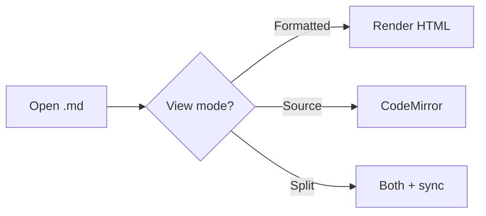
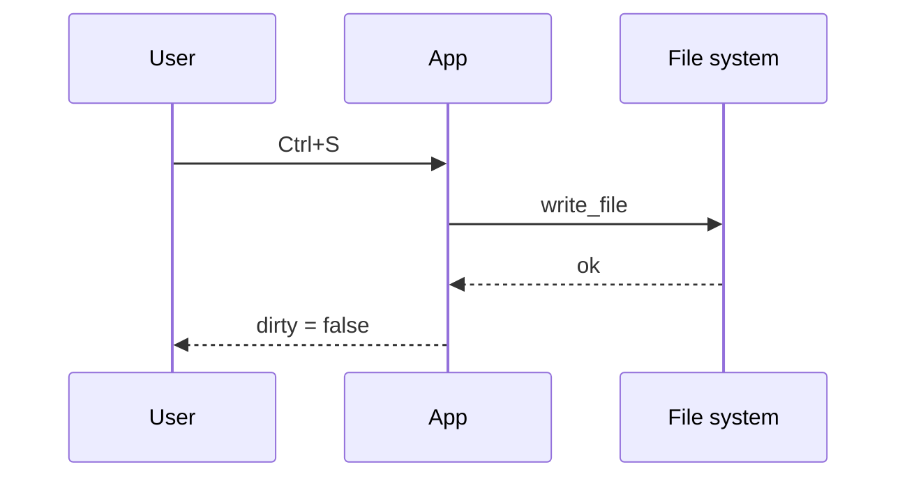

# Mermaid Fixture

## Flowchart

```mermaid
flowchart LR
  A[Open .md] --> B{View mode?}
  B -->|Formatted| C[Render HTML]
  B -->|Source| D[CodeMirror]
  B -->|Split| E[Both + sync]
```

## Sequence

```mermaid
sequenceDiagram
  participant U as User
  participant A as App
  participant FS as File system
  U->>A: Ctrl+S
  A->>FS: write_file
  FS-->>A: ok
  A-->>U: dirty = false
```

## Broken diagram (should show an error, not crash)

```mermaid
flowchart LR
  A --> 
```
