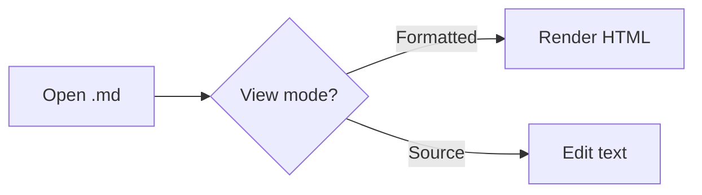

# Guide

Welcome to **Markdown**, a small, fast Markdown viewer and editor for Windows. This guide covers
everything the app does. You can come back to it any time by pressing **F1**, clicking the
**Guide** button in the toolbar, or (from the start screen) the “Read the guide” link.

## Welcome

Open a file and it shows up rendered, just like a document. Flip to **Source** to edit the raw
Markdown, or **Split** to see both at once. Switch between them with **Ctrl+E** (Formatted ↔
Source) and **Ctrl+Shift+E** (toggle Split). The app always starts in Formatted view, even if you
last had a document open in Source.

If you ever get stuck, this guide is one press away: **F1** opens it from anywhere in the app.

## Opening and creating files

- Double-click a `.md` or `.markdown` file in File Explorer, or choose *Open with → Markdown*.
- **Ctrl+O** opens the file picker; you can select several files at once.
- Drag one or more files in from Explorer and drop them anywhere on the window.
- **Recent files** are listed on the start screen (the five most recent); *Clear* removes them
  all.
- **Ctrl+N** starts a new, untitled document straight in Source view, so you can start typing
  immediately.

Whichever way a file is opened, its text encoding (UTF-8, with or without a byte-order mark, or
UTF-16) and line endings (Windows CRLF or Unix LF) are kept exactly as they are and restored when
you save. If a file has bytes that aren’t valid text, they’re shown as � and a banner warns you
that saving would make that replacement permanent.

## Tabs and windows

Whether an opened file becomes a new tab in this window or a whole new window is controlled by
**Open files in** in Settings → General (**New tab**, the default, or **New window**).

In tab mode:

- **Ctrl+T** opens a new tab; **Ctrl+W** closes the current one.
- **Ctrl+Tab** / **Ctrl+Shift+Tab** and **Ctrl+PageDown** / **Ctrl+PageUp** move to the next or
  previous tab.
- **Ctrl+1** … **Ctrl+9** jump straight to a tab by position (**Ctrl+9** always means the last
  tab).
- Drag a tab to reorder it, or, with a tab focused, use **Ctrl+Shift+←** / **Ctrl+Shift+→**.
- Right-click a tab for **Close**, **Close others**, **Close to the right**, **Copy path** and
  **Reveal in File Explorer**.
- A file already open in a tab is focused instead of opened a second time.

If the app is already running and you open a `.md` file from Explorer, it opens as a new tab in
the running window, which comes to the front (tab mode), or in a new window unless the current
window is empty or showing the start screen (window mode).

**Open tabs aren’t restored when the app restarts** — this is by design. The app always starts on
the start screen, or with whatever file it was launched with.

## Views

- **Formatted** shows the rendered document. A **full width** toggle in the toolbar fits it to the
  window instead of the preset’s usual content width; the choice is remembered.
- **Source** is a plain-text editor with Markdown syntax highlighting.
- **Split** shows both side by side. The **swap panes** toolbar button flips which side the source
  editor is on (also set persistently in Settings → General → *Split layout*). Scrolling either
  pane scrolls the other to match. An optional highlight, off by default, tints the formatted block
  that holds your cursor as a band across the whole pane, like the editor’s current line; turn it
  on with *Highlight the cursor’s block in Split view* in Settings → General.

**Zoom** (**Ctrl+=**, **Ctrl+−**, **Ctrl+0**, or **Ctrl** + mouse wheel over the formatted view)
changes the size of the *rendered* document only; it doesn’t affect the Source editor, which has
its own **Font size** setting. The current zoom level is shown in the status bar — click it to
reset to 100%.

## Editing

Right-click anywhere in the Source editor for a menu with, on a misspelled word, spelling
suggestions plus **Add to dictionary** and **Ignore**; then **Cut**, **Copy**, **Paste**, **Select
all**; then formatting: a **Heading** submenu (Heading 1–6, or Paragraph to remove one), **Bold**,
**Italic**, **Strikethrough**, **Inline code**, **Link**, **Code block**, **Quote**, **Bulleted
list**, **Numbered list**, **Task list** and **Horizontal rule**. The **Menu** key or
**Shift+F10** opens the same menu at the cursor without a mouse. In the formatted view, right-click
gives you **Copy** and **Select all**.

The formatting shortcuts are **Ctrl+B** (Bold), **Ctrl+I** (Italic), **Ctrl+K** (Link) and
**Ctrl+Shift+1** … **Ctrl+Shift+6** (Heading 1–6; press the same heading’s shortcut again to turn
it back into a paragraph). With text selected, they wrap the selection; with nothing selected,
Bold/Italic/Inline code/Link apply to the word under the cursor (or insert empty markers with the
cursor between them if there’s no word there). Applying a format that’s already there removes it.
Heading, Quote, Code block and the list formats apply to every line your selection touches.
**Link** turns the selection into `[text](url)` with `url` already selected, ready to type or
paste over.

**Ctrl+S** saves; for a new, untitled document (or when there’s nowhere to save to yet) it opens
the **Save as** dialog instead (**Ctrl+Shift+S**), suggesting a file name taken from the
document’s first heading (or its first line, if it has none). Closing a document, a tab or the
whole app with unsaved changes asks whether to save first, discard, or cancel. If the file changes
on disk while you have unsaved edits, a banner lets you reload from disk or keep what you have; if
it changes while you have no unsaved edits, it’s reloaded automatically.

## Spell check

Turn spell checking on or off, and choose which languages to check, in Settings → General →
Spelling. It runs in the Source editor only (the formatted view isn’t editable, so there’s nothing
to check there), and underlines words in red wherever they’re wrong in *every* language you’ve
ticked — so a note that mixes, say, English and Arabic works correctly. Until you tick anything,
the app automatically checks the language matching Windows’ current display language (or English
if that one isn’t installed).

The language list shows the languages **Windows** has dictionaries for, one entry per language
(the app picks the right regional variant for you). If a language you want isn’t listed, add it in
Windows: **Settings → Time & language → Language & region → Add a language** — spelling comes with
the language’s basic typing feature, no separate download needed. At least one language always
stays ticked once you’ve made a choice; to stop checking altogether, turn off *Check spelling*
instead.

Right-click a misspelled word for suggestions, or:

- **Add to dictionary** — remembers the word for good. It’s stored in the app’s own settings (not
  the shared Windows dictionary), and listed under *Personal dictionary* in Settings, where you
  can remove any of them again.
- **Ignore** — stops the word being flagged for the rest of this session (it’s forgotten again
  once you close the app).

Spell check skips fenced and indented code, inline code, URLs and autolinks, link and image
destinations, reference-style link definitions, raw HTML tags, maths (`$…$` and `$$…$$`), YAML
front matter, and HEX colour codes.

## Outline and Find

The **Outline** (**Ctrl+\\**, or the toolbar button) lists the document’s headings in a
collapsible tree on the left. Click a heading — or press Enter/Space when it has focus — to jump
to it; the outline follows your scroll position, highlighting the section you’re in. Use the
buttons at the top to expand or collapse one level at a time, or everything at once. Drag its
right edge, or use the arrow keys on it, to resize it.

**Find** (**Ctrl+F**) searches the current view: the Source editor when you’re in Source view, or
the rendered text when you’re in Formatted or Split. Match case with the **Aa** button, move
between results with Enter / Shift+Enter (or the buttons titled *Next (Enter)* and *Previous
(Shift+Enter)*), and close it with Escape or the button titled *Close (Esc)*.

## Styling

The theme button in the toolbar (its icon and tooltip show the current choice) cycles the app’s
own **Light**, **Dark** and **Follow Windows** theme — this is the app’s chrome; the document’s
look is separate, below.

Settings → Presets lists the built-in presets — **Boulayla** (the default), **GitHub**,
**Obsidian**, **Claude**, **Manuscript**, **Nord**, **Rosé Pine**, **Catppuccin** and
**Solarized** — plus any you’ve made yourself. Click one to use it. Every preset has its own light
and dark colour set, so it looks right in both app themes.

In Settings → Appearance you can edit the active preset’s fonts, base size, line height, content
width, heading sizes and weight, block spacing, and every colour — separately for light and dark
(a segmented control switches which one you’re editing). Editing a built-in preset saves your
changes as a new custom preset instead of overwriting the original. Back in Settings → Presets you
can **Copy** any preset, **Rename** or **Delete** a custom one, and **Export** any preset (or
**Import**) as a JSON file, handy for sharing or backing up.

Settings → Custom CSS gives the active preset a slot for your own CSS, applied on top of
everything else so it can override anything. It targets elements inside `.preview`, for example:

```css
.preview h1 {
  letter-spacing: -0.02em;
}
.preview blockquote {
  font-style: italic;
}
```

## Links and images

In the formatted view: `http(s)://` and `mailto:` links open in your default browser or mail app.
A relative link to another Markdown file (`.md`, `.markdown`, `.mdown`, `.mkd` or `.txt`) opens it
in the app — as a new tab or window, or focusing it if it’s already open — without disturbing what
you already have open. A relative link to anything else reveals that file in File Explorer.
`#anchor` links scroll to the matching heading.

Local images are only ever loaded from the open document’s own folder (including subfolders) — an
image reference that points anywhere else won’t load, by design. **Block remote images**, in
Settings → General, stops `http(s)` image sources from loading at all, for documents you don’t
fully trust.

## Export and print

The toolbar’s export button offers:

- **Export as HTML…** — a standalone HTML file that reproduces the formatted view with the active
  preset’s styling baked in. With **Self-contained HTML export** on (Settings → General → Export,
  on by default), local images and the maths font are embedded as data straight in the file, so it
  works offline anywhere; remote images stay linked, and the bundled preset fonts fall back to
  whatever’s on the system that opens it.
- **Print / Save as PDF…** — opens the normal Windows print dialog on the formatted view, where
  *Save as PDF* is one of the printer choices.

## Markdown cheat sheet

**Headings**

Start a line with one to six `#` characters: `#` is the largest heading, `######` the smallest.
(The example uses levels 3 and 4 so it doesn’t add sections to this guide’s outline.)

```markdown
### Heading 3
#### Heading 4
```

### Heading 3
#### Heading 4

**Emphasis and strikethrough**

```markdown
*italic*, **bold**, ~~strikethrough~~
```

*italic*, **bold**, ~~strikethrough~~

**Lists**

```markdown
- Bulleted item
1. Numbered item
- [x] A finished task
- [ ] An unfinished task
```

- Bulleted item
1. Numbered item
- [x] A finished task
- [ ] An unfinished task

**Quotes**

```markdown
> A quoted line.
```

> A quoted line.

**Links**

```markdown
[Markdown](https://en.wikipedia.org/wiki/Markdown)
```

[Markdown](https://en.wikipedia.org/wiki/Markdown)

**Tables**

```markdown
| Name | Note  |
|------|-------|
| Sky  | blue  |
| Rose | pink  |
```

| Name | Note  |
|------|-------|
| Sky  | blue  |
| Rose | pink  |

**Code, with syntax highlighting**

````markdown
```js
function greet(name) {
  return `Hello, ${name}!`;
}
```
````

```js
function greet(name) {
  return `Hello, ${name}!`;
}
```

**Footnotes**

```markdown
Here’s a claim that needs a source.[^1]

[^1]: The source.
```

Here’s a claim that needs a source.[^1]

[^1]: The source.

**Maths**

```markdown
Inline: $e^{i\pi} + 1 = 0$

Block:

$$
\int_{-\infty}^{\infty} e^{-x^2}\,dx = \sqrt{\pi}
$$
```

Inline: $e^{i\pi} + 1 = 0$

Block:

$$
\int_{-\infty}^{\infty} e^{-x^2}\,dx = \sqrt{\pi}
$$

**Mermaid diagrams**

````markdown

````


**HEX colour swatches**

A HEX colour code gets a small swatch next to it in the formatted view, for example `#6cb6ff`.

## Keyboard shortcuts

| Shortcut | Action |
|---|---|
| Ctrl+N | New file |
| Ctrl+O | Open file |
| Ctrl+S | Save |
| Ctrl+Shift+S | Save as |
| Ctrl+T | New tab |
| Ctrl+W | Close tab |
| Ctrl+Tab / Ctrl+Shift+Tab | Next / previous tab |
| Ctrl+PageDown / Ctrl+PageUp | Next / previous tab |
| Ctrl+1 … Ctrl+9 | Go to tab |
| Ctrl+Shift+← / Ctrl+Shift+→ | Move tab left / right |
| Ctrl+E | Toggle formatted / source |
| Ctrl+Shift+E | Toggle split view |
| Ctrl+\\ | Toggle outline |
| Ctrl+F | Find |
| Ctrl+, | Settings |
| F1 | Guide |
| Ctrl+= / Ctrl+− / Ctrl+0 / Ctrl+wheel | Zoom preview |

**Editing (Source view)**

| Shortcut | Action |
|---|---|
| Ctrl+B | Bold |
| Ctrl+I | Italic |
| Ctrl+K | Link |
| Ctrl+Shift+1 … Ctrl+Shift+6 | Heading 1–6 (press again for a paragraph) |

## Settings reference

Open Settings with **Ctrl+,** or the toolbar button.

**Application**

| Setting | What it does | Default |
|---|---|---|
| Open files in | New tab, or a new window per file | New tab |
| Theme | The app’s own light / dark / Follow Windows theme | Dark |
| Split layout | Which side the Source editor sits on in Split view | Source left, formatted right |
| Highlight the cursor’s block in Split view | Tints the formatted block that holds the Source cursor, across the whole pane | Off |
| Show outline | Shows or hides the outline sidebar | On |
| Show status bar | Shows or hides the status bar | On |
| Preview zoom | The formatted view’s zoom level | 100% |
| Block remote images | Stops `http(s)` images loading in the preview | Off |

**Source editor**

| Setting | What it does | Default |
|---|---|---|
| Line numbers | Shows line numbers in the gutter | On |
| Font size | The Source editor’s text size | 14px |

**Spelling**

| Setting | What it does | Default |
|---|---|---|
| Check spelling | Turns spell checking on or off | On |
| Languages | Which installed Windows languages are checked | Automatic (see Spell check) |
| Personal dictionary | Words added with *Add to dictionary* | Empty |

**Export**

| Setting | What it does | Default |
|---|---|---|
| Self-contained HTML export | Embeds images and maths fonts in exported HTML | On |

A few other things are remembered automatically without a Settings row of their own: the **full
width** toggle in Formatted view, the outline’s width, and the divider position in Split view —
each just remembers wherever you last left it.

## Troubleshooting

- **“This file was changed on disk”**: someone or something else edited the file while you had
  unsaved changes here. Choose **Reload from disk** to take their version (losing your edits), or
  **Keep mine** to dismiss the warning and carry on (your next save will overwrite theirs). If the
  file was deleted or moved instead, the banner tells you that and only offers **Keep mine**.
- **A save prompt about replaced characters**: the file had bytes that aren’t valid text, shown as
  � when it was opened; saving makes that replacement permanent. Choose **Save anyway** or
  **Cancel** and fix the file another way first.
- **No spelling languages listed**: Windows has no spelling dictionaries installed. Add one under
  **Settings → Time & language → Language & region → Add a language** (see Spell check, above).
- **Where things are stored**: settings and presets live in
  `%APPDATA%\com.bilal.markdown-viewer\` (`settings.json`, `presets.json`).
